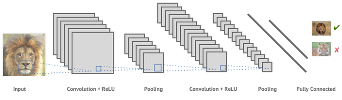

# Image Captioning

Este repositorio em como objetivo criar uma algortitmo que possa gerar legandas
automaticamente para imagens.

Este algotritmo é baseado no paper [*Show and Tell*](https://arxiv.org/abs/1411.4555).

### O problema
Algoritmos para geração de legendas para imagens compõem um problema completo de AI, ou seja, eles precisam entender mais de um área de AI para conseguir resolver o problema.
Primeiro o algoritmo deve entender dados de imagens e em segundo lugar devem ser hábil com texto em linguagem natural.

![a imagem mostra o fluxo de processamento de um algoritmo de geração de legendas para imagens. O fluxo se inicia com uma imagem de uma gato siamês dormindo, em segunda o fluxo avança para uma caixa que simboliza uma rede neural convolucional, e está escrito “Características visuais”. Na sequência o fluxo avança para uma segunda caixa chamada rede neural recorrente onde está escrito “características textuais”. Por fim o fluxo avança para uma última caixa escrito “Predição da resposta” que aponta para a resposta do algoritmo : Resposta Rq “Gato dormindo”.](docs/images/image-captioning.png)

*A imagem mostra o fluxo de processamento de um algoritmo de geração de legendas para imagens. O fluxo se inicia com uma imagem de uma gato siamês dormindo, em segunda o fluxo avança para uma caixa que simboliza uma rede neural convolucional, e está escrito “Características visuais”. Na sequência o fluxo avança para uma segunda caixa chamada rede neural recorrente onde está escrito “características textuais”. Por fim o fluxo avança para uma última caixa escrito “Predição da resposta” que aponta para a resposta do algoritmo : Resposta Rq “Gato dormindo”.*

Para imagens existem as redes neurais Convolucionais, de diversos tipos e tamanhos disponíveis em trabalhos acadêmicos ou mesmo no github.

Para lidar com texto, usualmente são utilizadas as redes neurais recorrentes, que são ótimas para processamento de dados sequenciais (texto é uma cadeia de dados sequenciais).

Para gerar legenda em imagens, teremos que combinar essas duas redes neurais.

Esse problema é relativamente antigo, desde de 2015 temos soluções bem robustas para ele, e por isso existe um grande número de trabalhos e exemplos para consulta.

O grande problema que enfrentaremos é que esses algoritmos exigem uma quantidade muito grande (milhões) de exemplos para que possam ser devidamente treinados. Existem algumas dezenas de modelos treinados disponíveis na web, mas quase todos geram legenda em inglês. Para português, temos que treinar nós mesmos os algoritmo, o que demandará tempo e esforço.

Uma solução de contorno será a utilização de um modelo treinado em inglês e submeter a sair de texto para um tradutor automático.

### Show And Tell

Algoritmo [Show and Tell(Bengio, 2015)](https://arxiv.org/abs/1411.4555) é bem famoso para esse tipo de tarefa, porém ele é antigo, sofrendo algumas atualizações como [Show, Tell and Atend (Bengio, 2015)](https://arxiv.org/abs/1502.03044). O algoritmo *Show and Tell* foi liberado pelo google em 2016, tendo várias implementações no github. O problema com esse algoritmo é que ele tem que ser treinado pelo prṕrio usuário.

### Datasets

Para este algoritimo estamos usando o conjunto de dados [Flickr_8k](https://github.com/jbrownlee/Datasets). composto por 8002 imagens, com descrições (*em inglês*).

Ainda estamos buscando um c onjunto de dados com descrições em português, ou mesmo traduzir as descrições que atualmentes encontram-se em inglês.

## Links e Fontes Bibliográficas
https://olhardigital.com.br/noticia/google-libera-algoritmo-que-descreve-imagens-com-94-de-precisao/62443

http://openaccess.thecvf.com/content_CVPR_2019/html/Zheng_Intention_Oriented_Image_Captions_With_Guiding_Objects_CVPR_2019_paper.html

https://www.captionbot.ai/

https://towardsdatascience.com/image-captioning-with-keras-teaching-computers-to-describe-pictures-c88a46a311b8

https://machinelearningmastery.com/develop-a-deep-learning-caption-generation-model-in-python/

http://karpathy.github.io/2015/05/21/rnn-effectiveness/

http://colah.github.io/posts/2015-08-Understanding-LSTMs/

https://docs.google.com/document/d/1nT_Z79RISuVfeHeDGXrt-nWYlRjmgIYsa5-IDd5v_ks/edit?ts=5dded12b#

https://machinelearningmastery.com/clean-text-machine-learning-python/
