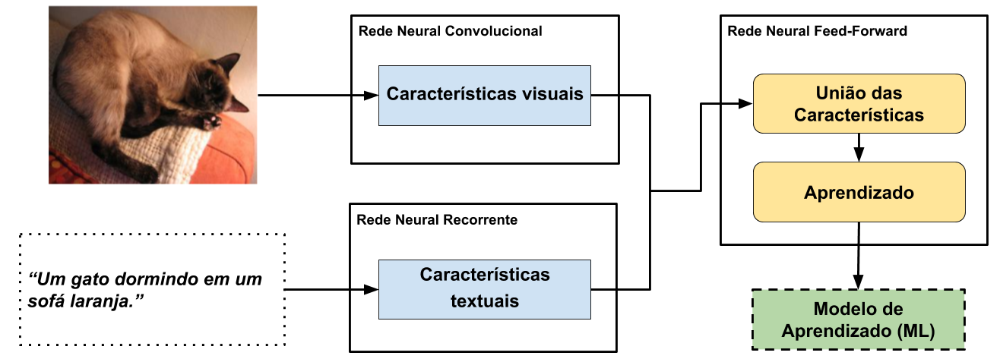
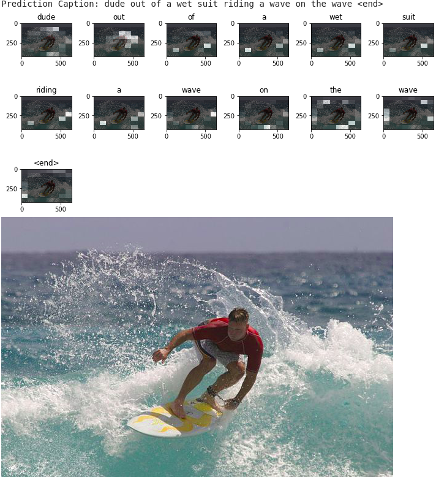

# Fluxo de Trabalho

Esse fluxo foi baseado nos estudos abaixo:

 * [Where to put the Image in an Image Caption Generator
](https://arxiv.org/abs/1703.09137)

* [What is the Role of Recurrent Neural Networks (RNNs) in an Image Caption Generator?](https://arxiv.org/abs/1708.02043)

Este algoritimo é uma demonstração do algoritmo [*Show, Attend and Tell: Neural Image Caption Generation with Visual Attention*](https://arxiv.org/abs/1502.03044) que tem por objetivo analisar uma imagem e descrevê-la textualmente.

## O problema
Algoritmos para geração de legendas para imagens compõem um problema completo de AI, ou seja, eles precisam entender mais de um área de AI para conseguir resolver o problema.
Primeiro o algoritmo deve entender dados de imagens e em segundo lugar devem ser hábil com texto em linguagem natural.

## O Algortimo

Algoritmo [Show and Tell(Bengio, 2015)](https://arxiv.org/abs/1411.4555) é bem famoso para esse tipo de tarefa, porém ele é antigo, sofrendo algumas atualizações como [Show, Tell and Atend (Bengio, 2015)](https://arxiv.org/abs/1502.03044). O algoritmo *Show and Tell* foi liberado pelo google em 2016, tendo várias implementações no github. O problema com esse algoritmo é que ele tem que ser treinado pelo prṕrio usuário.

## Carregando o Dataset

Para carregar o nosso conjunto de dados de treinamento, primeiro iremos fazer o download das [imagens](http://images.cocodataset.org/zips/train2014.zip) e das [descrições das imagens](http://images.cocodataset.org/annotations/annotations_trainval2014.zip).

Usaremos o conjunto de dados [MS-COCO](http://cocodataset.org/#home) para treinar nosso modelo. O conjunto de dados contém mais de 82.000 imagens, cada uma das quais com pelo menos 5 anotações de legenda diferentes. O código abaixo baixa e extrai o conjunto de dados automaticamente.

Cuidado: download grande adiante. Você usará o conjunto de treinamento, que é um arquivo de 13 GB.

## Pré-processamento das imagens usando a rede neural InceptionV3
para pré-processar as imagens usaremos a rede Neural [InceptionV3](https://en.wikipedia.org/wiki/Inceptionv3) (que é pré-treinado no Imagenet) para extrair vetores com carateríscas de cada imagem. Para isso iremos pegar a saída da última camada convolucional (antes do classificador).

Usaremos a biblioteca tqdm para cachear as imagens pré-processadas

## Pré-processar e tokenizar as legendas

---

* Primeiro, iremos tokenizar as legendas (quebrar as frases em palavras). Isso nos fornece um vocabulário de todas as palavras exclusivas nos dados (por exemplo, "surf", "futebol" e assim por diante).

* Em seguida, limitaremos o tamanho do vocabulário em **5.000 palavras** principais (para economizar memória). Você substituirá todas as outras palavras pelo token "UNK" (desconhecido).

* Em seguida, criaremos os mapeamentos palavra-índice e índice-palavra.

* Por fim, preencheremos todas as seqüências com o mesmo comprimento que a mais longa (normalizaçao)

## Divisão do Dataset

Em geral os datasets possuem três partes

* Treinamento: contém exemplos que serão usamos para calibrar (treinar) os pesos do model de Machine Learning (e.g. Redes Neurais, SVM, Regressores, etc...)

* Validação: Durante o treinamento da Rede, utilizamos uma parte de Dataset para validar como está o desemprenho do modelo ao final de cada iteração (época). Esses exemplos não podem ter sido utilizados no treinamento, chamamos de essa porção de validação.

* Teste: Esse é a parta mais importante do Conjunto. O conjunto de testes contém exemplos que o modelo nunca viu em nenhuma das fases anteriores. A partir desses exemplos conseguimos aferir o quanto a rede generaliza para exemplos novos.

Geralmente a proporção de dados em cada porção do dataset é 70%/20%/10% mas isso não é regra.

Para facilitar o nosso exemplo, utilziaremos apenas o conjunto de trainemanto dividido entre Trainemaneto (80%) e validação (20%). O teste fica por sua conta.

## Criando o modelo de Rede Neural

A arquitetura do modelo é inspirada no artigo [Show, Attend and Tell](https://arxiv.org/pdf/1502.03044.pdf)

 * Neste exemplo, extrairemos as características da camada convolucional inferior da Rede Nerual InceptionV3, fornecendo um vetor com dimensões (8, 8, 2048).

 * achataremos o vetor para ficar (64,2048)

 * Esse vetor é passado pelo Encoder CNN (rede Convolucional) (que consiste em uma única camada totalmente conectada).

 * O RNN (aqui GRU) analisa a imagem para e tentar prever a próxima palavra da sequência (descrição).

## Treinamento da Rede Neural

 * extraimos os vetores de caracteríísticas armazenados nos arquivos .npy e passa esses recursos pelo codificador.

 * A saída do codificador, o estado oculto (inicializado em 0) e a entrada do decodificador (que é o token de início) são passados ​​para o decodificador.

 * O decodificador retorna as previsões e o estado oculto do decodificador.

 * O estado oculto do decodificador é então passado de volta ao modelo e as previsões são usadas para calcular a perda.

 * Usamos *Teacher Forcing* para decidir a próxima entrada para o decodificador.

 * *Teacher Forcing* é a técnica em que a palavra alvo é passada como a próxima entrada para o decodificador.

 * A etapa final é calcular os [gradientes](http://cursos.leg.ufpr.br/ML4all/apoio/Gradiente.html) e aplicá-lo ao otimizador e ao [backpropagate](http://deeplearningbook.com.br/algoritmo-backpropagation-parte-2-treinamento-de-redes-neurais/).

 ## Gerando as descrições

se você chegou atéé aqui parabéns. Agora poderemos colher os frutos do treinamentro da nossa Rede Neural.

 * A função `evaluate` é semelhante ao loop de treinamento, exceto que você não usa *Teacher Forcing* aqui. A entrada para o decodificador em cada etapa do tempo é suas previsões anteriores, juntamente com o estado oculto e a saída do codificador.
 * A previsãão para quando o modelo encontrar o Token final.

 * E armazenamos os pesos (*ver gradiente*) do mecanismo de atenção para cada etapa.

#### Desenhando o que a rede "*enxergou*"

